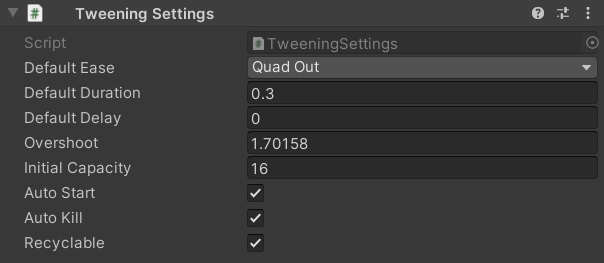

# Settings

The Tweening package provides a few global settings that can be modified. Settings can either be changed through a static class, or through a mono behavior. The following settings are available:

- [defaultEase](xref:Zigurous.Tweening.Tweening.defaultEase): The default [Ease](xref:Zigurous.Tweening.Ease) assigned to every tween ([Ease.QuadOut](xref:Zigurous.Tweening.Ease.QuadOut)). The ease used by a tween can be set manually if desired.
- [defaultDuration](xref:Zigurous.Tweening.Tweening.defaultDuration): The default amount of seconds a tween takes to complete (`0.3`). The duration of a tween can be set manually if desired.
- [defaultDelay](xref:Zigurous.Tweening.Tweening.defaultDelay): The default amount of seconds before every tween starts (`0`). The delay of a tween can be set manually if desired.
- [overshoot](xref:Zigurous.Tweening.Tweening.overshoot): The overshoot value used in easing functions (`1.70158`).
- [initialCapacity](xref:Zigurous.Tweening.Tweening.initialCapacity): The initial amount of tweens memory is allocated for when the system starts (`16`). Additional memory will be allocated as needed.
- [autoStart](xref:Zigurous.Tweening.Tweening.autoStart): Automatically starts tweens after being created (`true`). This is can be turned on/off manually per tween if desired.
- [autoKill](xref:Zigurous.Tweening.Tweening.autoKill): Automatically kills tweens after being completed (`true`). This is can be turned on/off manually per tween if desired.
- [recyclable](xref:Zigurous.Tweening.Tweening.recyclable): Keeps tweens in memory to be re-used after being killed (`true`). This can be turned on/off manually per tween if desired.

### Changing settings with code

Tweening settings can be changed through the static class [Settings](xref:Zigurous.Tweening.Settings).<br/>
Below are all of the settings and their default values:

```csharp
Settings.defaultEase = Ease.QuadOut;
Settings.defaultDuration = 0.3f;
Settings.defaultDelay = 0.0f;
Settings.overshoot = 1.70158f;
Settings.initialCapacity = 16;
Settings.autoStart = true;
Settings.autoKill = true;
Settings.recyclable = true;
```

### Changing settings in the editor

The Tweening package includes a mono behaviour called [TweeningSettings](xref:Zigurous.Tweening.TweeningSettings) that can be added to your scene. This is generally used to provide a simple interface for changing settings in the Unity editor rather than through code. You can, of course, still use this behavior to change settings at runtime if desired.


